# Criar um Banco de Dados SQL no Azure

## Criar um Banco de dados SQL

Na página inicial do Azure, pesquise “Bancos de dados SQL” na barra de pesquisa na parte superior.
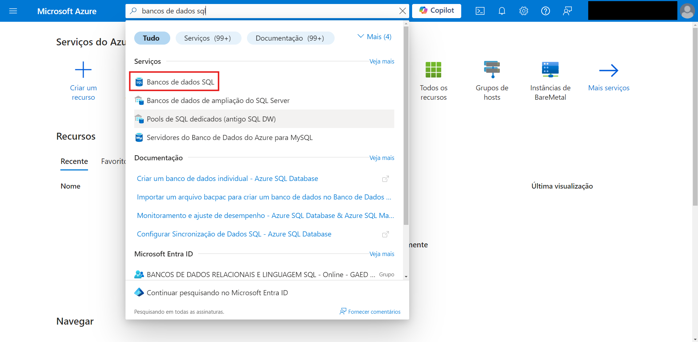

Na página Bancos de dados SQL, clique no botão “Criar”.
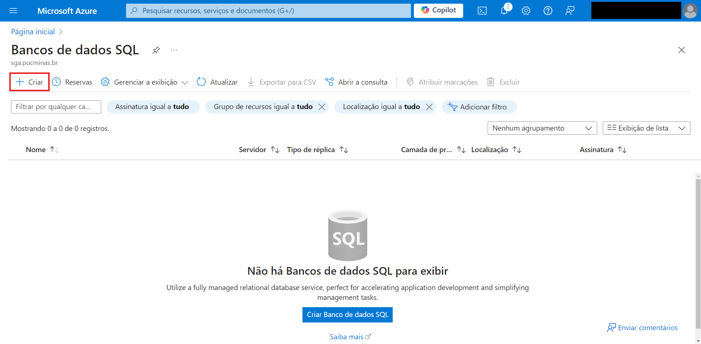

## Configuração

### Básico

- Assinatura: Escolha sua assinatura do Azure.
- Grupo de recursos: Selecione um grupo de recursos existente ou crie um novo.

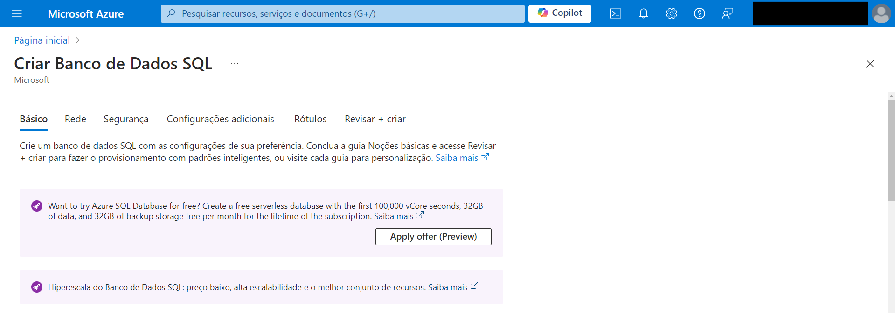
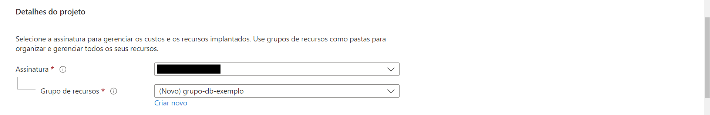

- Nome do banco de dados: Insira um nome exclusivo para seu banco de dados.

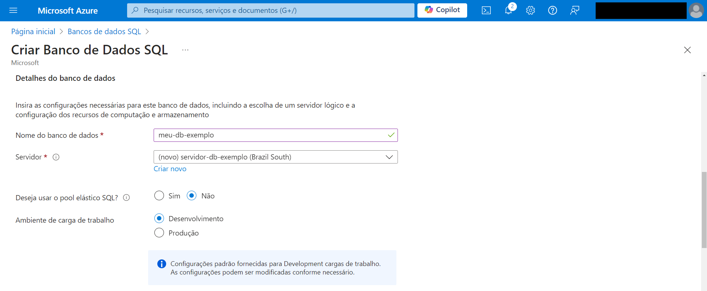

- Servidor: Você precisará selecionar um servidor existente ou criar um novo.
  - Para criar um novo servidor, clique em “Criar novo” próximo ao campo Servidor. Preencha o nome do servidor, localização e os detalhes do método de autenticação. Clique em OK para criar o servidor.
  
  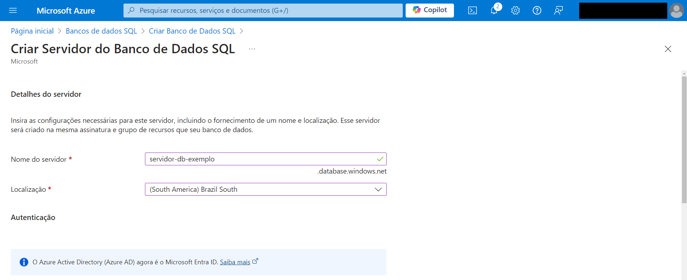
  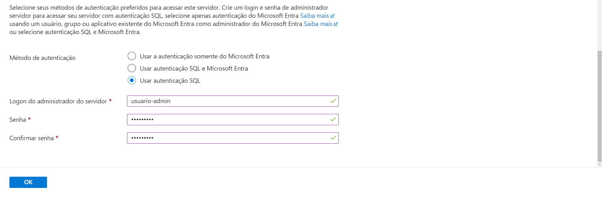

- Computação + armazenamento: Clique em Configurar banco de dados para ajustar os DTUs ou vCores, bem como o tamanho do armazenamento. Depois de configurado, clique em Aplicar.

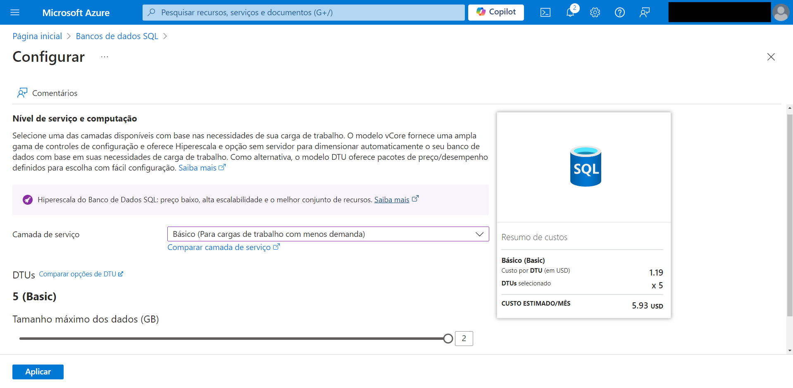

- Redundância do armazenamento de backup: Escolha uma opção de redundância de backup.

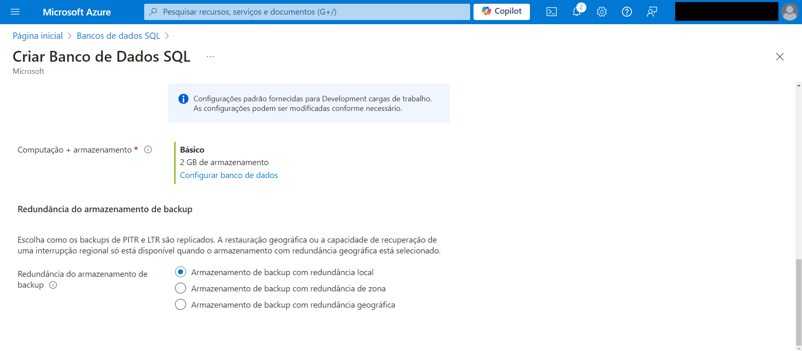

### Rede

- Escolha Ponto de extremidade público ou Ponto de extremidade público dependendo da configuração da sua rede.
  - Para acesso público, defina Permitir que serviços e recursos do Azure acessem este servidor como Sim (se necessário). Defina Adicionar o endereço IP do cliente atual como Sim (se necessário).

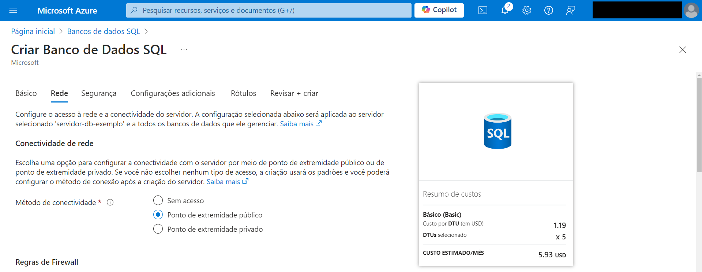
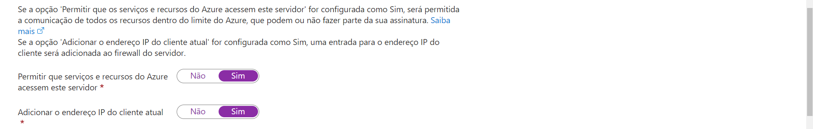

### Configurações adicionais

- Fonte de dados: Escolha começar com um banco de dados em branco ou restaurar a partir de um backup.
- Ordenação: Mantenha o padrão ou escolha as configurações de ordenação (se necessário).

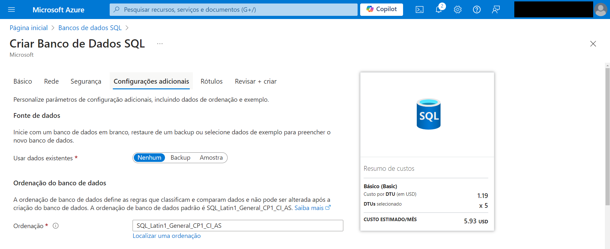

### Revisar + Criar

- Verifique seus custos e todas as suas configurações que você fez.
- Clique em Criar para implementar o banco de dados. O Azure começará a provisionar o banco de dados SQL e os recursos relacionados.

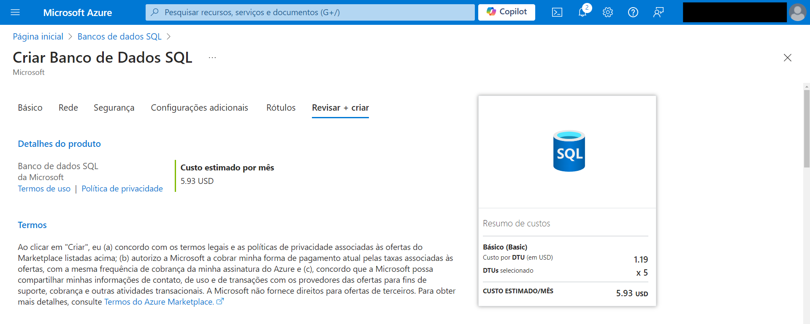
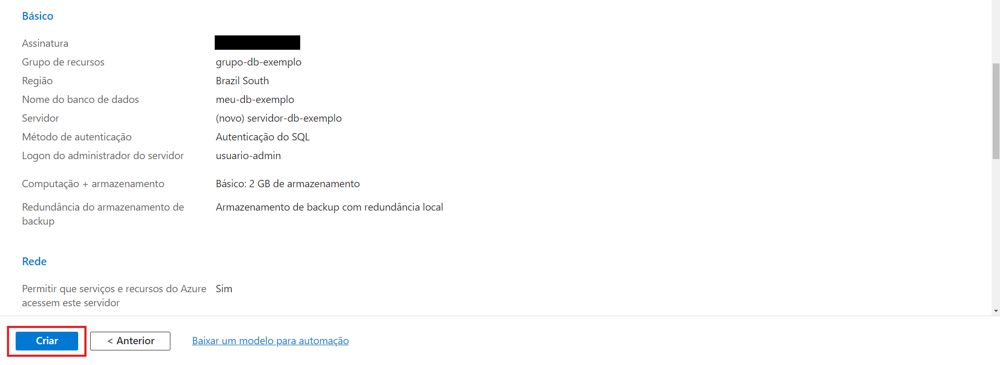  
